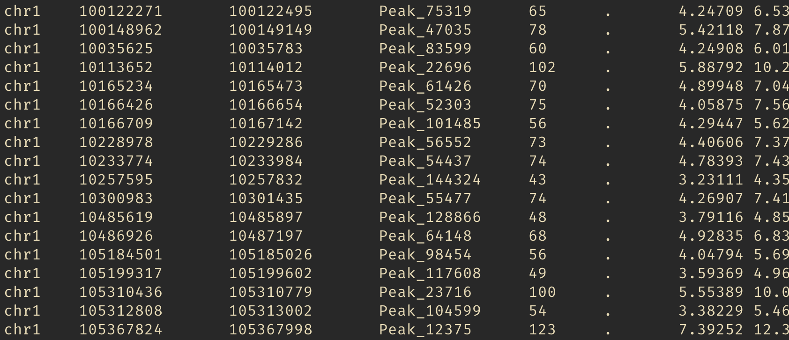

```{r echo=FALSE}
suppressPackageStartupMessages(library(tidyverse))
```

# Data organization depends on purpose


# "Tidy data" is organized for programming

One row per observation, one column per variable

```{r include=FALSE}
dat <- read_delim("data.tsv")
dat$value <- runif(nrow(dat))
dat$drug <- factor(dat$drug)
```

```{r}
head(dat)
```

# The pipe

```
command | command | command > output.txt
```

\vspace{2em}

> "Pipes rank alongside the hierarchical file system and regular expressions as one of the most powerful yet elegant features of Unix-like operating systems."

<http://www.linfo.org/pipe.html>

\vspace{2em}

In R we use `'%>%'` instead of `'|'` to chain operations.

# Verb-based operations

In the R package *dplyr*:

\small
* `mutate()` adds new variables that are functions of existing variables.
* `select()` picks variables based on their names.
* `filter()` picks cases based on their values.
* `slice()` picks cases based on their position.
* `summarize()` reduces multiple values down to a single summary.
* `arrange()` changes the ordering of the rows.

<https://dplyr.tidyverse.org/>
\normalsize

# Summarize after grouping

A useful paradigm is to *group* data and then *summarize*:

```{r eval=FALSE}
dat %>%
  group_by(drug, genotype) %>%
  filter(!outlier) %>%
  summarize(mu_hat = mean(value))
```

# Summarized output

```{r echo=FALSE, message=FALSE}
dat %>%
  group_by(drug, genotype) %>%
  filter(!outlier) %>%
  summarize(mu_est = mean(value))
```

# Piping into plots

```{r fig.dim=c(5,2)}
dat %>%
  mutate(newvalue = value^2) %>%
  ggplot(aes(genotype, newvalue)) + 
  geom_boxplot() + 
  facet_wrap(~drug)
```

# Lots of genomic range data is already tidy



# Practical considerations

* Many comp students are already familiar with dplyr/ggplot2
* Less variable names, e.g. `dat3 <- dat2[dat2$signal > x]`
* It's not necessarily *less code*, but aims for readable code

# Why consider "tidy analysis" paradigm for genomics?

* Encourages exploratory analysis, vs. "all-in-one" functions
* Encourages efficiency: less calls to underlying C code
* Generalizes from simple to complex cases

# Bringing range data into R

```{r echo=FALSE}
suppressPackageStartupMessages(library(plyranges))
```

```{r}
library(plyranges)
pks <- read_narrowpeaks("ENCFF231UNV.bed.gz")
```

```{r echo=FALSE}
#library(GenomeInfoDb)
#si <- Seqinfo(genome="mm10")
#si <- keepStandardChromosomes(si)
#save(si, file="si.rda")
load("si.rda")
seqlevels(pks) <- seqlevels(si)
seqinfo(pks) <- si
```

# Bringing range data into R

\tiny
```{r}
pks
```
\normalsize

# Example operations with plyranges

```{r eval=FALSE}
pks %>%
  filter(seqnames %in% paste0("chr",1:3),
         qValue > 2) %>%
  mutate(width_bin = cut(width, 
                         breaks=c(0,300,500,5000), 
                         include.lowest=TRUE)) %>%
  group_by(width_bin, seqnames) %>%
  summarize(freq = n()) %>%
  as_tibble() %>%
  ggplot(aes(width_bin, freq)) + 
  geom_col() + 
  facet_wrap(~seqnames)
```

# Example operations with plyranges

```{r echo=FALSE, fig.dim=c(7,2.5)}
pks %>%
  filter(seqnames %in% paste0("chr",1:3),
         qValue > 2) %>%
  mutate(width_bin = cut(width, 
                         breaks=c(0,300,500,5000), 
                         include.lowest=TRUE)) %>%
  group_by(width_bin, seqnames) %>%
  summarize(freq = n()) %>%
  as_tibble() %>%
  ggplot(aes(width_bin, freq)) + 
  geom_col() + 
  facet_wrap(~seqnames)
```

# Making use of range information

Grouping by genomic overlaps (with `maxgap` and/or `minoverlap`)

Suppose a query set of ranges, `gr`:

```{r echo=FALSE}
gr <- GRanges("chr1", IRanges(51:53 * 1e6 + 1, width=1e6), 
              query_id=1:3)
seqinfo(gr) <- si
```

```{r}
gr %>%
  group_by_overlaps(pks) %>%
  summarize(mu=mean(score), sd=sd(score), n=n())
```

# Picking out a representative

\small
```{r}
gr %>%
  group_by_overlaps(pks) %>%
  slice(which.max(score)) %>%
  ungroup() %>% 
  select(score)
```
\normalsize

# Keeping the ranges of the representative

\footnotesize
```{r}
pks %>%
  select(score) %>%
  join_overlap_inner(gr) %>%
  group_by(query_id) %>%
  slice(which.max(score))
```
\normalsize

# More complex cases

* The most common cases are computing summaries, overlaps
* More complex computations are possible, e.g.:
    - For peaks near genes, compute correlation of cell-type-specific accessibility and expression (Wancen Mu)
    - For regulatory variants falling in ATAC peaks, visualize their distribution stratified by SNP and peak categories (Jon Rosen)
    - For looped and unlooped enhancer-promoter pairs, compare average ATAC and RNA time series, while controlling for genomic distance and contact frequency (Eric Davis)

# Going further: extracting info from fitted models

```{r eval=FALSE}
library(broom)
gr %>%
  group_by_overlaps(pks) %>%
  as_tibble() %>%
  select(query, score, qValue) %>%
  nest(data = -query) %>%
  mutate(fit = map(data, ~lm(score ~ qValue, data=.)),
         fitted = map(fit, ~.x$fitted)) %>%
  unnest(c(data, fitted))
```

# Going further: extracting info from fitted models

```{r echo=FALSE}
library(broom)
gr %>%
  group_by_overlaps(pks) %>%
  as_tibble() %>%
  select(query, score, qValue) %>%
  nest(data = -query) %>%
  mutate(fit = map(data, ~lm(score ~ qValue, data=.)),
         fitted = map(fit, ~.x$fitted)) %>%
  unnest(c(data, fitted))
```

# Some pointers

* TSS: `anchor_5p() %>% mutate(width=1)`
* Flanking sequence: `flank_left` or `flank_upstream`
* Flatten/break up ranges: `reduce_ranges`, `disjoin_ranges`
* Concatenating ranges: `bind_ranges`
* Overlaps are handled often with "joins": `join_overlap_*`, 
  `join_nearest`, `join_nearest_downstream`, etc.

# More tutorials online

* *plyranges* vignettes (on Bioc and GitHub)
* Enrichment of peaks and genes: "Fluent Genomics" workflow
* *nullranges* vignettes (on Bioc and GitHub), which provides block bootstrap and matching functionality that pairs easily with *plyranges*
* Other examples, incl. bootstrap: "Tidy Ranges Tutorial"
* BioC2022: Wancen Mu & Eric Davis *nullranges* workshop

# Tidy analysis for genomic data

{width=23%} {width=23%} {width=23%} {width=23%}

* Encourages exploratory analysis, vs. "all-in-one" functions
* Encourages efficiency: less calls to underlying C code
* Generalizes from simple to complex cases

# Reading

\small
* Lee, S., Cook, D. & Lawrence, M. plyranges: a grammar of genomic data transformation. Genome Biology 20, 4 (2019). <https://doi.org/10.1186/s13059-018-1597-8>
* Lee S, Lawrence M and Love MI. Fluent genomics with plyranges and tximeta. F1000Research 2020, 9:109 <https://doi.org/10.12688/f1000research.22259.1>
* plyranges vignettes <https://sa-lee.github.io/plyranges>
* Tidy Ranges Tutorial <https://nullranges.github.io/tidy-ranges-tutorial>
* bootRanges, matchRanges, see: <https://nullranges.github.io/nullranges>

Tidy analysis for matrix data:

* Mangiola, S., Molania, R., Dong, R. et al. tidybulk: an R tidy framework for modular transcriptomic data analysis. Genome Biology 22, 42 (2021). <https://doi.org/10.1186/s13059-020-02233-7>
* tidySummarizedExperiment, see: <https://stemangiola.github.io/tidySummarizedExperiment>
