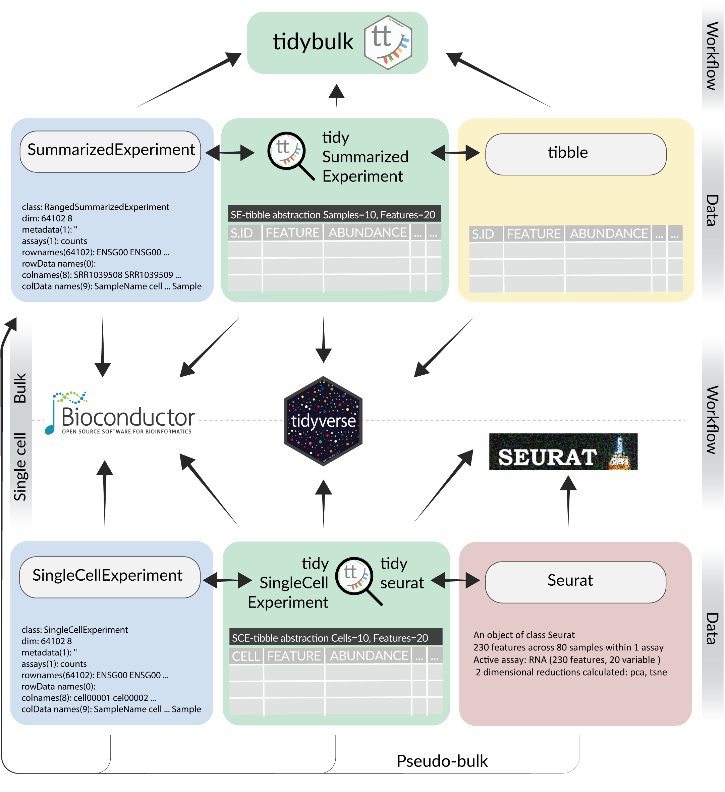

```{r echo=FALSE}
suppressPackageStartupMessages(library(tidyverse))
```

# Data organization depends on purpose


# "Tidy data" is organized for programming

One row per observation, one column per variable

```{r include=FALSE}
dat <- read_delim("data.tsv")
dat$value <- runif(nrow(dat))
dat$drug <- factor(dat$drug)
```

```{r}
head(dat)
```

# The pipe

```
command | command | command > output.txt
```

\vspace{2em}

> "Pipes rank alongside the hierarchical file system and regular expressions as one of the most powerful yet elegant features of Unix-like operating systems."

<http://www.linfo.org/pipe.html>

\vspace{2em}

In R we use `'%>%'` instead of `'|'` to chain operations.

# Verb-based operations

In the R package *dplyr*:

\small
* `mutate()` adds new variables that are functions of existing variables.
* `select()` picks variables based on their names.
* `filter()` picks cases based on their values.
* `slice()` picks cases based on their position.
* `summarize()` reduces multiple values down to a single summary.
* `arrange()` changes the ordering of the rows.
* `group_by()` perform any operation by group.

<https://dplyr.tidyverse.org/>
\normalsize

# Summarize after grouping

A useful paradigm is to *group* data and then *summarize*:

```{r eval=FALSE}
dat %>%
  filter(!outlier) %>%
  group_by(drug, genotype) %>%
  summarize(mu_hat = mean(value))
```

# Summarized output

```{r echo=FALSE, message=FALSE}
dat %>%
  filter(!outlier) %>%
  group_by(drug, genotype) %>%
  summarize(mu_est = mean(value))
```

# Piping directly into plots!

```{r fig.dim=c(5,2)}
dat %>%
  mutate(newvalue = value^2) %>%
  ggplot(aes(genotype, newvalue)) + 
  geom_boxplot() + 
  facet_wrap(~drug)
```

# Genomic range data is often already tidy


# Tidy advantages

\Large

* Many already familiar with dplyr and ggplot2
* Avoid intermedite variables, e.g.:
  ```{r eval=FALSE}
  dat3 <- dat2[dat2$signal > x]
  ```
* Aim is for *readable* code

\normalsize

# Why "tidy analysis" for genomics?

\Large

* Encourages exploration
* Encourages efficiency: fewer calls out of R
* Generalizes from simple to complex cases
* Developer side: modularity is easier to maintain

\normalsize

# Bringing range data into R

ENCODE mouse embryonic fibroblast, H3K4me1:

\vspace{2em}

```{r echo=FALSE}
suppressPackageStartupMessages(library(plyranges))
```

```{r}
library(plyranges)
pks <- read_narrowpeaks("ENCFF231UNV.bed.gz")
```

Alternatively:

```{r eval=FALSE}
pks <- read.csv("file.csv") %>% 
  rename(seqnames = chr) %>%
  as_granges()
```

```{r echo=FALSE}
#library(GenomeInfoDb)
#si <- Seqinfo(genome="mm10")
#si <- keepStandardChromosomes(si)
#save(si, file="si.rda")
load("si.rda")
seqlevels(pks) <- seqlevels(si)
seqinfo(pks) <- si
```

# Another common paradigm, separating single column

```{r eval=FALSE}
pks <- read.delim("file.tsv") %>%
  separate(location, ":|-", # e.g. chr1:123-456
           into=c("seqnames","start","end")) %>%
  as_granges()
```

# Bringing range data into R

\footnotesize
```{r}
pks %>% slice(1:3) %>% select(signalValue)
```
\normalsize

# Example use of *plyranges*

* For a set of query ranges, `tiles` (here three 1 Mb ranges)
* Find all overlaps between `pks` and `tiles`
* Perform computation on the overlaps

```{r echo=FALSE}
tiles <- GRanges("chr1", IRanges(51:53 * 1e6 + 1, width=1e6), 
                 tile_id=1:3)
seqinfo(tiles) <- si
```

\footnotesize
```{r}
tiles
```
\normalsize

# Consider overlaps as a `join`

```{r echo=FALSE, fig.align="center", out.width="50%"}
# https://www.flickr.com/photos/hellothomas/5073821890

```

* We are joining two sources of information by match
* How would you then pick top scoring peak (`pks`) per `tile`?
* What verbs would be involved?

# Consider overlaps as a `join`

\footnotesize
```{r}
pks %>%
  select(score) %>% # just `score` column
  join_overlap_inner(tiles) %>% # overlap -> add cols from tiles
  group_by(tile_id) %>% # group matches by which tile
  slice(which.max(score)) # take the top scoring peak
```
\normalsize

# Counting overlaps

* Use "`.`" to specify self within a command
* Add number of overlaps to each entry in `tiles`:
* Can specify `maxgap` and/or `minoverlap`

\vspace{1em}

\footnotesize
```{r}
tiles %>% mutate(n_overlaps = count_overlaps(., pks))
```
\normalsize

# More complex cases

* For peaks near genes, compute correlation of cell-type-specific accessibility and expression (Wancen Mu)
* For regulatory variants falling in open chromatin peaks, visualize their distribution stratified by SNP and peak categories (Jon Rosen)
* For looped and un-looped enhancer-promoter pairs, compare average ATAC and RNA time series, while controlling for genomic distance and contact frequency (Eric Davis)
* For DHS in a region of interest with particular genomic characteristics, compare overlap with functional annotation within and in comparison to matched regions from elsewhere in genome (Euphy Wu, Lexi Bounds, Pat Sullivan)

# Going further: extracting info from fitted models

* Nest $\rightarrow$ map $\rightarrow$ unnest
* Allows model fitting within data groups, see also `glance` and `augment`

```{r eval=FALSE}
library(broom)
pks %>%
  join_overlap_inner(tiles) %>%
  as_tibble() %>%
  select(tile_id, score, qValue) %>%
  nest(data = -tile_id) %>%
  mutate(fit = map(data, ~lm(score ~ qValue, data=.)),
         fitted = map(fit, ~.x$fitted)) %>%
  unnest(c(data, fitted))
```

# Going further: extracting info from fitted models

```{r echo=FALSE}
library(broom)
pks %>%
  join_overlap_inner(tiles) %>%
  as_tibble() %>%
  select(tile_id, score, qValue) %>%
  nest(data = -tile_id) %>%
  mutate(fit = map(data, ~lm(score ~ qValue, data=.)),
         fitted = map(fit, ~.x$fitted)) %>%
  unnest(c(data, fitted))
```

# Some pointers

* TSS: `anchor_5p() %>% mutate(width=1)`
* Overlaps can specify `*_directed` or `*_within`
* Flatten/break up ranges: `reduce_ranges`, `disjoin_ranges`
* Concatenating ranges: `bind_ranges` with `.id` argument
* Overlaps are handled often with "joins": `join_overlap_*`, 
  `join_nearest`, `join_nearest_downstream`, etc.
* Also `add_neareast_distance`
* Load *plyranges* last to avoid name masking with *AnnotationDbi*
  and *dplyr*

# More *plyranges*-based tutorials online

* *plyranges* vignettes (on Bioc and GitHub)
* Enrichment of peaks and genes: "Fluent Genomics" workflow
* *nullranges* vignettes (on Bioc and GitHub)
* Other examples, incl. bootstrap: "Tidy Ranges Tutorial"
* BioC2022: Wancen Mu & Eric Davis *nullranges* workshop
* `#tidiness_in_bioc` and `#nullranges` Slack channels

# Summary: tidy analysis for genomic range data

```{r echo=FALSE, fig.show="hold", fig.align="center", out.width="25%"}
knitr::include_graphics(c("dplyr.png","GenomicRanges.png"))
```

```{r echo=FALSE, fig.show="hold", fig.align="center", out.width="25%"}
knitr::include_graphics(c("plyranges.png","nullranges.png"))
```

\small
*nullranges* development sponsored by CZI EOSS {width=50px}
\normalsize

# See also: tidy analysis of transcriptomic data

```{r echo=FALSE, fig.align="center", out.width="60%"}

```

[Tidy Transcriptomics](https://stemangiola.github.io/tidytranscriptomics/post/tidy-transcriptomics-manifesto/)

# Reading

\small
* Lee, S, Cook, D, Lawrence, M. plyranges: a grammar of genomic data transformation. *Genome Biology* (2019) [10.1186/s13059-018-1597-8](https://doi.org/10.1186/s13059-018-1597-8)
* Lee S, Lawrence M, Love MI. Fluent genomics with plyranges and tximeta. *F1000Research* (2020) [10.12688/f1000research.22259.1](https://doi.org/10.12688/f1000research.22259.1)
* plyranges vignettes [sa-lee.github.io/plyranges](https://sa-lee.github.io/plyranges)
* Tidy Ranges Tutorial 
  [tidyomics.github.io/tidy-ranges-tutorial](https://tidyomics.github.io/tidy-ranges-tutorial)
* nullranges: bootRanges, matchRanges
  [nullranges.github.io/nullranges](https://nullranges.github.io/nullranges)
* excluderanges [dozmorovlab.github.io/excluderanges](https://dozmorovlab.github.io/excluderanges/)

Tidy analysis for matrix data:

* Mangiola, S, Molania, R, Dong, R et al. tidybulk: an R tidy framework for modular transcriptomic data analysis. *Genome Biology* (2021) [10.1186/s13059-020-02233-7](https://doi.org/10.1186/s13059-020-02233-7)
* tidySE, tidySCE, tidyseurat
  [stemangiola.github.io/tidytranscriptomics](https://stemangiola.github.io/tidytranscriptomics)
