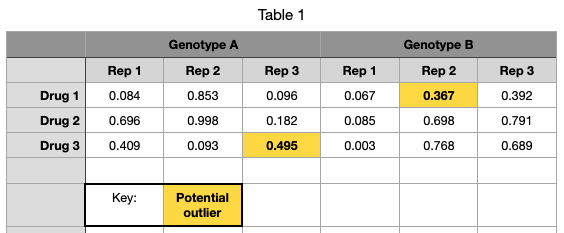

```{r echo=FALSE}
suppressPackageStartupMessages(library(tidyverse))
```

# Example data



# Tidy data

One row per observation, one column per variable

```{r include=FALSE}
dat <- read_delim("data.tsv")
dat$value <- runif(nrow(dat))
```

```{r}
head(dat)
```

# The pipe

```
command | command | command > output.txt
```

\vspace{2em}

> "Pipes rank alongside the hierarchical file system and regular expressions as one of the most powerful yet elegant features of Unix-like operating systems."

<http://www.linfo.org/pipe.html>

\vspace{2em}

In R we use `%>%` instead of `|` to chain operations.

# Verb-based operations

In the R package *dplyr*, we have operations:

* `mutate()` adds new variables that are functions of existing variables
* `select()` picks variables based on their names.
* `filter()` picks cases based on their values.
* `summarise()` reduces multiple values down to a single summary.
* `arrange()` changes the ordering of the rows

<https://dplyr.tidyverse.org/>

# Summarize after grouping

A useful paradigm is to *group* data by one variable and *summarize*:

```{r eval=FALSE}
dat %>%
  group_by(drug, genotype) %>%
  filter(!outlier) %>%
  summarize(mu_hat = mean(value))
```

# Summarized output

```{r echo=FALSE, message=FALSE}
dat %>%
  group_by(drug, genotype) %>%
  filter(!outlier) %>%
  summarize(mu_hat = mean(value))
```

# More stuff

genomic data already tidy, show narrow peak
import narrow peak
show some example overlaps
bootranges and matchranges

